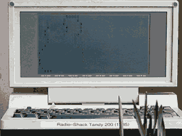
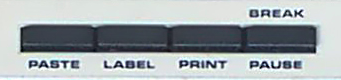

# Tandy-Terminfo
Tandy Model 100, 102, 200 Terminfo for screen control on UNIX machines

## What is this?
When using the TELCOM terminal program on a Tandy portable computer such as the Model 200, the remote host needs to know how to send escape sequences to do things like clear the screen, move the cursor, show text in reverse, and so on. In UNIX, that information is stored in the TERMINFO database and then used by setting the TERM environment variable. 

This repository provides both the [source TERMINFO](tandy.terminfo) file and the [compiled versions](.terminfo/t/). 

## Installation
Download the [source TERMINFO](tandy.terminfo) file and compile it with `tic` on your UNIX host.

    tic tandy.terminfo
    
That will create the proper files in your `.terminfo` directory so they can be used immediately.

## Usage
Set your TERM environment variable to one of the available terminal types (see below) to inform programs how to talk to your Tandy. For example,

    export TERM=td200
    
There are different terminal types for the Model 100 (`td100`) and the
Model 200 (`td200`) as those have a different number of lines.

There are also different types depending upon whether you have your
status line ("labels") disabled or not. By default it is presumed you will
disable the status line by pressing the LABEL button. If you do not
wish to disable the status line, use the `-s` variant, like so,

    export TERM=td200-s
    
For convenience, there are aliases so you can refer to the TERM by
number of lines instead of whether it has a status line (`td200-15`).

## The list of available terminals

* `td200`: Tandy Model 200 (no status line). 40 columns x 16 rows.
  Aliases: `td200-ns`, `td200-16`.
* `td200-s`: Tandy Model 200 (has status line). 40 columns x 15 rows.
  Alias:`td200-15`.
* `td100`: Tandy Model 100 (no status line). 40 columns x 8 rows.
  Aliases: `td100-ns`, `td100-8`
* `td100-s`: Tandy Model 100 (has status line). 40 columns x 7 rows.
  Alias: `td100-7`
* `td102`: Tandy Model 102 (no status line). 40 columns x 8 rows.
  Aliases: `td102-ns`, `td102-8`
* `td102-s`: Tandy Model 102 (has status line). 40 columns x 7 rows.
  Alias: `td102-7`

## Suggestions

While setting the `TERM` environment variable will get you most of the
way to a usable interface, there are some other commands which I
recommend running when using a Tandy portable as a terminal. You can
put these in your `.bash_profile` so they'll be sourced when you login
or you can put them in a file and use `source filename` to read the
commands into your current shell.

### tandy.bash_profile
    # Set terminal type to Tandy 200 with no status line
    export TERM=td200-ns
    # Turn on software flow control (^S/^Q)
    stty ixon ixoff
    # Send ASCII, not Unicode UTF-8 characters
    export LANG=C
    # Some programs don't pay attention to the size in the TERMINFO
    stty rows 16 cols 40
    # Backspace key sends ^H not ^?
    stty erase ^H
    # Right arrow key sends ^\, so don't use that to abort and dump core.
    stty quit ^-

### .inputrc for arrow keys

I also recommend adding the following to your `.inputrc` so that the
arrow keys will work in Bash and other programs that use libreadline.

	$if term=td200
	Control-^: previous-history
	Control-_: next-history
	Control-]: forward-char
	Control-\: backward-char	# Use 'stty quit undef' to make this work.
	$endif

### .emacs for flow control

Emacs by default uses C-s for search. You can tell emacs that the
td200 will be using C-s for XON/XOFF flow control by adding this to
your .emacs file:

	;; Tandy 200 is too slow and 
	;; requires XON/XOFF flow control.
	(enable-flow-control-on "td200")

## Testing

You can test whether it worked by pressing Control-L. If it clears the
screen, then you have correctly installed the TERMINFO files. You can
also try running a `curses` program, such as the BSD game "worms"
which animates ASCII worms crawling on your screen. (`apt install
bsdgames`)

## Problems

* If you have trouble with the screen occasionally scrolling, be sure
  you have the status line turned off by pressing the LABEL button.

* If you are trying to use the arrow keys, many applications will not
  accept them because Tandy's TELCOM program sends them as simple
  control-key characters instead of escape sequences.

        key_up=^^, key_down=^_,
        key_left=^], key_right=^\,

  However, see the workaround above for Bash and other readline programs.

* If control-L clears the screen, but certain programs show
  uninterpreted escape sequences (e.g., `0;m`), then the problem is
  that those programs are not using TERMINFO correctly. They are
  instead implementing VT102 or "ANSI" terminal escape sequences
  themselves which not only is redundant work, it is incorrect.

  Reportedly buggy programs:
  * man and pacman
  * bash's PS1 prompt
  * w3m (works if *Display With Color* option is set to 0, `w3m -color=0`)
  * git (works, but shows `31m` for colors). 

  You can test if an application is indeed buggy by running `xterm -ti
  vt52 -tn vt52`. If that terminal shows the same errors as on your
  Tandy Model 100/102/200, then it is the program that is at fault and
  you should file a bug report with that project. On the other hand,
  if vt52 works (does not show escape sequences) but Tandy doesn't,
  please file a bug with this project. Bug reports are always
  appreciated.

## Notes on using the TELCOM program

* For a standard serial port @9600 baud, type this command in TELCOM:

    stat 88n1enn

* 19200 bps works fine if your UNIX getty is configured to talk that speed:

    stat 98n1enn

* Software flow control (XON/XOFF) is absolutely necessary as the 8250 UART has a one byte buffer. 

* Hardware flow control (RTS/CTS) is not available.

* Because of network latency software flow control may be inadequate over `ssh`.

* To connect to a PC running UNIX, you'll need a null modem cable.

* The Tandy Model 200 has a *FEMALE* 25 pin RS-232c port. 

### Special keys:

    \    GRPH -          Backslash
    |    GRPH SHIFT _    Pipe
    `    GRPH [          Backtick
    ~    GRPH SHIFT ]    Tilde
    {    GRPH 9          Open curly brace
    }    GRPH 0          Close curly brace
    ^@   GRPH P          Sends 0x80, useful in Emacs to set the mark 

Note that Tandy docs say CTRL-@ is supposed to work, but it does not.

## History

This started out as a woefully inadequate TERMCAP entry for Xenix in
the back of the Radio Shack manual. It claims to be based on the DEC
VT52, but that seems [approximate](compare.vt52) at best.

Just for historical interest, here is the original Tandy 16/Xenix
termcap entry from page 72 of the TELCOM Manual:

    n1|td200|Tandy 200:\
      :am:bs:xt:co#40:li#16:al=\EL:dl=\EM:cd=^L:ce=\EK:cl=\EE:cm=\EY%+ %+ :\
      :nd=^\:dn=^_:up=\EA:se=\Eq:so=\Ep:kl=^J:kr=^^:ku=^^:kd=^_:

## Future

This will hopefully eventually be added to the official TERMINFO databases used by BSD and GNU/Linux systems, but it'd be good to find out all the undocumented features before doing that. 

### Questions

* How does one write to the status line? 
  It's not vt52 as that didn't have tsl/fsl.
  h19? Nope. Didn't quite work.
  vt100-s? Nope. Failed completely.
  Wyse 50 labels? TODO.
* Is it possible to read the Function keys? 
* What about VT100 line drawing characters?
* Should the `td200` entry default to presuming the status line _off_ (which is the preferred way to use it) or _on_ (which is how the TELCOM software always starts up). 
* Can the TELECOM status line be switched on and off by escape codes? 
* Eight bit codes show up as graphics characters, but they are not in
  Latin-1 order. Is there something that can be done about that? It'd
  be nice to have umlauts and such

## Enabling a serial login on Unix systems with systemd and agetty

If you have a UNIX box running `systemd`, such as Debian GNU/Linux,
you can enable a serial port login like so:

    systemctl enable serial-getty@ttyS0
    systemctl start serial-getty@ttyS0

Presuming you have a serial port on `ttyS0`, of course. If you have a
USB to serial converter, try `ttyACM0`.

### Optional: allow different baud rates

The default baud rates should work with the Tandy portables as 9600 is
one of the standard ones. However, I wanted to allow both higher and
lower speeds. 

There may be a way to change the baud rates accepted using systemd,
but I don't know it. What I did is copy over the symlink that `enable`
created and then edited the file by hand.

    cd /etc/systemd/system/getty.target.wants/
    rm serial-getty@ttyS0.service
    cp /lib/systemd/system/serial-getty@.service serial-getty@ttyS0.service
    emacs serial-getty@ttyS0.service

If you set the baud rate to multiple values, the agetty program will
switch to the next one, if it's at the wrong speed, whenever you hit
the ENTER key. For example, you could use the following:

    ExecStart=-/sbin/agetty 115200,19200,9600,300 %I $TERM

When you connect with your Tandy portable, you'll see some garbage
characters instead of a Login prompt because it is talking at 115,200
bps. When you hit Enter, it'll try again at 19200. If you still get
line noise, hit Enter once more for 9600.

## Further Reading

* terminfo(5) - terminal capability data base
* tic(1) - the TERMINFO entry-description compiler
* infocmp(1) - compare or print out TERMINFO descriptions
* [Tandy 200 TELCOM manual](https://archive.org/details/Telcom_for_Tandy_200_1985_Microsoft)

## Table of Escape Sequences

* \eA: cursor Up
* \eB: cursor Down (is ^J equivalent?)
* \eC: cursor Right
* \eD: cursor Left (is ^H equivalent?)
* \eE: clear screen (same as \ej?)
* \e:
* \eH: cursor home
* \eI: Types Answerback id "#RSM200"
* \eJ: clear to the end of screen
* \eK: clear to the end of line
* \eL: insert line
* \eM: delete line
* \eP: cursor normal
* \eQ: cursor invisible
* \eR: _not used_ mystery! (restore saved line?)
* \eS: _not used_ mystery! (save current line?)
* \eT: enable status line (used only in init for variants which want the labels)
* \eU: disable status line
* \eV: _not used_ disable scrolling
* \eW: enable scrolling (used only in init)
* \eY: Move to cursor address
* \ej: _not used_ Clear screen
* \ep: Inverse text
* \eq: Normal text
* \er: _not used_ Something weird. Erases current line and displays " 7A tua". Huh?

## NOTEs

* What Tandy calls "LABELS" I call a
  "Status Line" because in terminfo
  parlance "Soft Labels" is for text
  above reprogrammable Function keys.
  From a Unix program's perspective,
  the Tandy Function keys are
  immutable. While "Status Line" is
  not quite correct as it doesn't
  show any status, it is more correct
  than the alternatives.

* Terminfo allows codes to overwrite
  the status line using tsl/fsl. We
  could implement tsl, but I don't
  see how we'd define fsl which is
  supposed to pop back to the
  previous cursor location. Since
  ncurses never uses tsl/fsl, there's
  probably no point in trying.

  For anyone who cares to try, the
  following will overwrite your
  status line for one second and then
  restore it.

    echo $'\eU\eY0 \eS\eM'$(date)$'\eT'
    sleep 1
    echo $'\eU\eY0 \eR\eT'

* Disable/re-enable status line

  Terminfo doesn't support enabling
  status lines, probably because
  ncurses can't even use them. It
  can, however, disable them with
  "dsl".

  So, I made a kludge that I think
  actually works pretty well: the
  "dsl" sequence for variants with
  status lines actually enables it. I
  think terminfo should either add
  enable_status_line or just let dsl
  mean "default_status_line": do the
  right thing for this terminal.

  Just for fun, my dsl strings also
  save and restore the labels in the
  status line using the undocumented
  \eS and \eR escape sequence. This
  works to properly turn off the
  status line then to re-enable it:

      $ TERM=td200
      $ tput dsl
      $ TERM=td200-s
      $ tput dsl

  By default, the Tandy terminals do
  *not* rewrite the last line of the
  screen when the status line is
  enabled with an escape sequence. That
  means you would not get back the line
  that says "Prev Down Up Full". 

* scroll back can be faked with HOME,
  Insert Line \eH\eL. But should we?
  Nah. Ncurses is smart enough to do it
  for us.

## TODO

* Why do man pages have `\e[m` sent at
  the end of each line, but *only* when
  my PAGER is less?

* Why do some programs use ANSI
  colors when my terminal isn't
  capable of it?

  * Bash for completions.
    (Disambiguating multiple
    completions when hitting tab twice)
  * git status
  * gcc error message
  * apt install

  Is it too much trouble these days
  to link with ncurses?

* `nano` requires the -p option or else it grumbles about XON/XOFF

* w3m doesn't work because it
  disables flow control. However, it
  can be run within emacs in
  w3m-mode.

* Try alternative charset 8bit?
  ac=+X,X.X

       The block graphic characters can be specified by three string capabili‐
       ties:

       as     start the alternative charset

       ae     end the alternative charset

       ac     pairs  of  characters.   The  first character is the name of the
              block graphic symbol and the second characters  is  its  defini‐
              tion.

       The following names are available:

       +    right arrow (>)
       ,    left arrow (<)
       .    down arrow (v)
       0    full square (#)
       I    lantern (#)
       -    upper arrow (^)
       '    rhombus (+)
       a    chess board (:)
       f    degree (')
       g    plus-minus (#)
       h    square (#)
       j    right bottom corner (+)
       k    right upper corner (+)
       l    left upper corner (+)
       m    left bottom corner (+)
       n    cross (+)
       o    upper horizontal line (-)
       q    middle horizontal line (-)
       s    bottom horizontal line (_)
       t    left tee (+)
       u    right tee (+)
       v    bottom tee (+)
       w    normal tee (+)
       x    vertical line (|)
       ~    paragraph (???)

       The  values in parentheses are suggested defaults which are used by the
       curses library, if the capabilities are missing.

* Line Graphics

  Many  terminals have alternate character sets useful for forms-drawing.
  Terminfo and curses build in support for the  drawing  characters  sup‐
  ported  by  the VT100, with some characters from the AT&T 4410v1 added.
  This alternate character set may be specified by the `acsc` capability.

      Glyph                           ACS                Ascii         VT100
      Name                            Name               Default       Name
      UK pound sign                   ACS_STERLING       f             }
      arrow pointing down             ACS_DARROW         v             .
      arrow pointing left             ACS_LARROW         <             ,
      arrow pointing right            ACS_RARROW         >             +
      arrow pointing up               ACS_UARROW         ^             -
      board of squares                ACS_BOARD          #             h
      bullet                          ACS_BULLET         o             ~
      checker board (stipple)         ACS_CKBOARD        :             a
      degree symbol                   ACS_DEGREE         \             f
      diamond                         ACS_DIAMOND        +             `
      greater-than-or-equal-to        ACS_GEQUAL         >             z
      greek pi                        ACS_PI             *             {
      horizontal line                 ACS_HLINE          -             q
      lantern symbol                  ACS_LANTERN        #             i
      large plus or crossover         ACS_PLUS           +             n
      less-than-or-equal-to           ACS_LEQUAL         <             y
      lower left corner               ACS_LLCORNER       +             m
      lower right corner              ACS_LRCORNER       +             j
      not-equal                       ACS_NEQUAL         !             |
      plus/minus                      ACS_PLMINUS        #             g
      scan line 1                     ACS_S1             ~             o
      scan line 3                     ACS_S3             -             p
      scan line 7                     ACS_S7             -             r
      scan line 9                     ACS_S9             _             s
      solid square block              ACS_BLOCK          #             0
      tee pointing down               ACS_TTEE           +             w
      tee pointing left               ACS_RTEE           +             u
      tee pointing right              ACS_LTEE           +             t
      tee pointing up                 ACS_BTEE           +             v
      upper left corner               ACS_ULCORNER       +             l
      upper right corner              ACS_URCORNER       +             k
      vertical line                   ACS_VLINE          |             x

  The best way to define a new device's graphics set is to add  a  column
  to  a  copy of this table for your terminal, giving the character which
  (when emitted between smacs/rmacs switches) will  be  rendered  as  the
  corresponding graphic.  Then read off the VT100/your terminal character
  pairs right to left in sequence; these become the ACSC string.

* Broken: scroll_reverse \eI just prints the letters "#RSM200", which I presume stands for Radio-Shack Model 200.

* Cursor keys work in vi, but not in
  Emacs. Emacs is doing something
  clever to get around xon/xoff brain
  damage. Right (^]) takes over for
  Search Forward (normally ^S) and Up
  (^^) is bound to quote next character
  (usually ^Q). This is actually kind
  of handy for me since I never use the
  arrow keys. I just wish they had
  bound one of the others to run Help,
  since that is missing as ^H.

* In light of orig.terminfo, double check
  reset_1string

* Checked and good: clr_eos,
  auto_left_margin, backspaces_with_bs,
  cursor_home, cursor_invisible,
  cursor_normal, cursor_right,
  cursor_down, init_tabs,
  column/row_adddress, key_left,
  key_right,

## Comparing origtd200 to td200.

    comparing booleans.
	auto_left_margin: F:T.
	xon_xoff: F:T.
    comparing numbers.
	init_tabs: NULL, 8.
    comparing strings.
	clr_eos: '^L', '\EJ'.
	column_address: NULL, '\EY %p1%' '%+%c'.
	cursor_down: '^_', '^J'.
	cursor_home: NULL, '\EH'.
	cursor_invisible: NULL, '\EQ'.
	cursor_normal: NULL, '\EP'.
	cursor_right: '^\', '\EC'.
	enter_reverse_mode: NULL, '\Ep'.
	exit_attribute_mode: NULL, '\Eq'.
	key_left: '^J', '^]'.
	key_right: '^^', '^\'.
	reset_1string: NULL, '\Eq\EE'.
	row_address: NULL, '\EY%p1%' '%+%c '.
	scroll_reverse: NULL, '\EI'.
