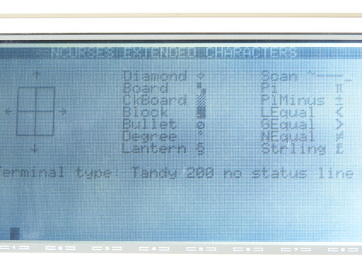

# Tandy-Terminfo
Tandy Model 100, 102, 200 Terminfo for screen control on UNIX machines

## What is this?

When using the TELCOM terminal program on a Tandy portable computer
such as the Model 200, the remote host needs to know how to send
escape sequences to do things like clear the screen, move the cursor,
show text in reverse, and so on. In UNIX, that information is stored
in the TERMINFO database and then used by setting the TERM environment
variable.

This repository provides both the [source TERMINFO](tandy.terminfo)
file and the [compiled versions](.terminfo/t/).

## Installation

Download the [source TERMINFO](tandy.terminfo) file and compile it
with `tic` on your UNIX host.

    tic tandy.terminfo

That will create the proper files in your `.terminfo` directory so
they can be used immediately.

## Usage

Set your TERM environment variable to one of the available terminal
types (see below) to inform programs how to talk to your Tandy. For
example,

    export TERM=td200

There are different terminal types for the Model 100 (`td100`) and the
Model 200 (`td200`) as those have a different number of lines.

There are also different types depending upon whether you have your
status line ("labels") disabled or not. By default it is presumed you
will disable the status line by pressing the LABEL button. If you do
not wish to disable the status line, use the `-s` variant, like so,

    export TERM=td200-s

For convenience, there are aliases so you can refer to the TERM by
number of lines instead of whether it has a status line (`td200-15`).

## The list of available terminals

* `td200`: Tandy Model 200 (no status line). 40 columns x 16 rows.
  Aliases: `td200-ns`, `td200-16`.
* `td200-s`: Tandy Model 200 (has status line). 40 columns x 15 rows.
  Alias:`td200-15`.
* `td100`: Tandy Model 100 (no status line). 40 columns x 8 rows.
  Aliases: `td100-ns`, `td100-8`
* `td100-s`: Tandy Model 100 (has status line). 40 columns x 7 rows.
  Alias: `td100-7`
* `td102`: Tandy Model 102 (no status line). 40 columns x 8 rows.
  Aliases: `td102-ns`, `td102-8`
* `td102-s`: Tandy Model 102 (has status line). 40 columns x 7 rows.
  Alias: `td102-7`

## Testing

You can test whether it worked by pressing Control-L. If it clears the
screen, then you have correctly installed the TERMINFO files. You can
also try running a `curses` program, such as the BSD game "worms"
which animates ASCII worms crawling on your screen. (`apt install
bsdgames`).

## Suggestions

While setting the `TERM` environment variable will get you most of the
way to a usable interface, there are some other commands which the
author, hackerb9, recommends running when using a Tandy portable as a
terminal. You can put these in your `.bash_profile` so they'll be
sourced when you login or you can put them in a file and use `source
filename` to read the commands into your current shell.

### td200 or .bash_profile

Here is a shell script, [td200](td200),
which configures the teminal and sets
up workarounds for some programs.
Because it sets environment variables,
you must source it by `source td200` or
`. td200`.

td200 script

    # Set terminal type to Tandy 200
    export TERM=td200
    # Send ASCII, not Unicode UTF-8 chars
    export LANG=C
    # Reset the terminal (turns off labels)
    reset
    # Turn on software flow control (^S/^Q)
    stty ixon ixoff
    # Some apps ignore the size in TERMINFO
    stty rows 16 cols 40
    # Backspace key sends ^H not ^?
    stty erase ^H
    # Right arrow key sends ^\, so don't use that to abort and dump core.
    stty quit undef
    # Translate Carriage Return to Newline (for uploads > N_TTY_BUF_SIZE)
    stty icrnl
    # Don't logout when exiting terminal mode in TELCOM
    stty clocal

    # Workarounds
    export MANPAGER=more
    export MANWIDTH=40
    export GCC_COLORS=""
    alias nano="nano -Opx"
    alias w3m="w3m -color=0"

    if [ $SHLVL -gt 1 ]; then
      echo "Error, do not run this script."
      echo "It must be sourced, like so:"
      echo -ne "\n\t"
      if type $(basename $0)>/dev/null 2>&1
      then
        echo ". $(basename $0)"
      else
        echo "source $0"
      fi
      echo
      exit 1
    fi

Tip 1: If you put the `td200` program
in your PATH and make it executable,
you can source it without specifying
the full path. For example, `. td200` .

Tip 2: You can automatically source the
td200 script from your .bash_profile
when logging in from a serial port like
so:

    # If logging in from a serial console,
    # it's my Tandy 200 Portable Computer.
    if [[ $(tty) =~ /dev/tty(S|ACM) ]]
    then
       source $HOME/bin/td200
    fi

### .inputrc for arrow keys

Hackerb9 also recommends adding the
following to your
[`.inputrc`](dot.inputrc) so that the
arrow keys will work in Bash and other
programs that use libreadline.

	$if term=td200
	    # No ANSI colors for tab completion
	    set colored-completion-prefix off

	    # Bind Model T's TELCOM keys
	    Control-^: previous-history
	    Control-_: next-history
	    Control-]: backward-char
	    # Use 'stty quit undef' to make right arrow work.
	    Control-\: forward-char
	    # Shift + BkSp to delete next char.
	    "\d": delete-char
	$endif

### .emacs for flow control

Emacs by default uses C-s for search. You can tell emacs that the
td200 will be using C-s for XON/XOFF flow control by adding this to
your .emacs file:

	;; Tandy 200/100/102 requires
	;; XON/XOFF flow control.
	(enable-flow-control-on "td200" "td100" "td102")

## Notes on using the TELCOM program

* For a standard serial port @9600 baud, type this command in TELCOM:

    stat 88n1enn

* 19200 baud works fine if your UNIX getty is configured to talk that speed:

    stat 98n1enn

* Software flow control (XON/XOFF) is absolutely necessary as the 8250
  UART has a one byte buffer. If you see text followed by garbage, try
  `stty ixon ixoff -ixany` .

* Hardware flow control (RTS/CTS) is not available.

* To connect to a PC running UNIX, you'll need a null modem cable.

* The Tandy Model 200 has a *FEMALE* 25 pin RS-232c port.

### Special keys:

    \    GRPH -          Backslash
    |    GRPH SHIFT _    Pipe
    `    GRPH [          Backtick
    ~    GRPH SHIFT ]    Tilde
    {    GRPH 9          Open curly brace
    }    GRPH 0          Close curly brace
    ^@   GRPH P          Sends 0x80, useful in Emacs to set the mark

Note that Tandy docs say CTRL-@ is supposed to work, but it does not.

## Enabling a serial login on Unix systems with systemd and agetty

If you have a UNIX box running `systemd`, such as Debian GNU/Linux,
you can enable a serial port login like so:

    systemctl enable serial-getty@ttyS0
    systemctl start serial-getty@ttyS0

(For a USB to serial converter, try `ttyACM0` instead of `ttyS0`.)

When you connect with your Tandy portable, you'll see some garbage
characters instead of a Login prompt and need to hit ENTER several
times. This is because getty tries 115,200 then 38,400 and finally
9600 baud. Every time you hit ENTER it should detect that the speed is
mismatched and switch to the next one. There is no harm in hitting
ENTER too many times as it won't change baud rate once they match.

### Optional: Change getty's default baud rate

You may wish to change the default baud rate so that it only connects
at 9600 baud. Hackerb9 suggests adding 19200 baud to the list since
the Tandy 200 can handle that and it is a significant improvement.

To do that, copy the symlink that `enable` created into a file, make a
symlink to the new file (because systemd is overly persnickety), and
then edit the file by hand.

	sudo -s
    systemctl enable serial-getty@ttyS0
    cd /etc/systemd/system/getty.target.wants/
	cp serial-getty@ttyS0.service ..
    ln -sf ../serial-getty@ttyS0.service 
    editor serial-getty@ttyS0.service
	exit

When editing, change the line that says:

	ExecStart=-/sbin/agetty -o '-p -- \\u' --keep-baud 115200,38400,9600 %I $TERM

to

	ExecStart=-/sbin/agetty -o '-p -- \\u' --keep-baud 19200,9600 %I $TERM

To connect at 19200 baud, you'll need to type this into TELCOM:

    stat 98n1enn

## Problems

* If you have trouble with the screen occasionally scrolling, be sure
  you have the status line turned off by pressing the LABEL button.

* If you are trying to use the arrow keys, many applications will not
  accept them because Tandy's TELCOM program sends them as simple
  control-key characters instead of escape sequences.

        key_up=^^, key_down=^_,
        key_left=^], key_right=^\,

  However, see the .inputrc workaround above for Bash and other
  readline programs.

* If control-L clears the screen, but certain programs show
  uninterpreted escape sequences (e.g., `0;m`), then the problem is
  that those programs are not using TERMINFO. They are instead
  presuming there is only one kind of terminal and implementing the
  escape sequences themselves which not only is redundant work, it is
  incorrect.

### Reportedly buggy programs

  * man (workaround, `export MANPAGER=more`)
  * bash's PS1 prompt, tab completion when ambiguous
  * gcc error messages (workaround, `export GCC_COLORS=""`)
  * w3m colors (workaround `w3m -color=0` or use **O**ptions to set
    *Display With Color* to 0)
  * w3m disables flow control (workaround, w3m-mode in emacs works fine)
  * git (workaround, disable ANSI color using `git config --add color.ui false`)
  * nano mumbles about XON/XOFF
	(workaround, `nano -p` or `set preserve` in .nanorc)
  * apt
  * pacman
  * ssh disables flow control (workaround, see below).

  You can test if an application is indeed buggy by running `xterm -ti
  vt52 -tn vt52`. If that terminal shows the same errors as on your
  Tandy 200, then it is the program that is at fault and you should
  file a bug report with that project. On the other hand, if xterm's
  vt52 emulation works (does not show escape sequences), please file a
  bug with this project. (Bug reports are always appreciated.)

### Ssh disables flow control

Because `ssh` disables flow control, it will often have garbage shown
on the screen. A workaround is to login from another terminal on the
local host after ssh has started and run:

    stty -F /dev/ttyS0 ixon ixoff

(Where `ttyS0` is the name of the serial port your Tandy is on.)

## Further Reading

* terminfo(5) - terminal capability data base
* tic(1) - the TERMINFO entry-description compiler
* infocmp(1) - compare or print out TERMINFO descriptions
* [Tandy 200 TELCOM manual](https://archive.org/details/Telcom_for_Tandy_200_1985_Microsoft)
  Particularly:
  * [Table of Escape Sequence Codes](https://archive.org/details/Telcom_for_Tandy_200_1985_Microsoft/page/n48/mode/1up)
  * [TERMCAP for use with Microsoft Xenix](https://archive.org/details/Telcom_for_Tandy_200_1985_Microsoft/page/n40/mode/1up):

## Table of Escape Sequences

The Escape sequences listed in the official manual were incomplete.
Here are the escape sequences which hackerb9's Tandy 200 responds to.

Sequence | Meaning | Notes
---------|---------|------
 \eA     | cursor Up
 \eB     | cursor Down | ^J may be equivalent.
 \eC     | cursor Right
 \eD     | cursor Left | ^H may be equivalent.
 \eE     | clear screen | \ej may be equivalent, undocumented in [TELCOM manual](https://archive.org/details/Telcom_for_Tandy_200_1985_Microsoft/page/n48/mode/1up), but this is what the sample TERMCAP in the same manual actually uses.
 \eF     | ignored | see Alternate Character Set section below
 \eG     | ignored
 \eH     | cursor home | Cursor moves to upper left corner
 \eI     | type answerback id | Types **"#RSM200"** on hackerb9's **R**adio-**S**hack **M**odel **200**.
 \eJ     | clear to the end of screen
 \eK     | clear to the end of line
 \eL     | insert line | moves lines below down
 \eM     | delete line | moves lines below up
 \eP     | cursor normal
 \eQ     | cursor invisible
 \eR     | restore saved line | _not documented,_ currently used by dsl to restore status line.
 \eS     | save current line | _not documented,_ currently used by dsl to save status line.
 \eT     | enable status line | used in init for variants which have a status line (e.g. td200-s).
 \eU     | disable status line | used in init_1string for variants which have no status line (e.g. td200).
 \eV     | disable scrolling | _not used,_ not defined by terminfo. Overwrites bottom line repeatedly. May be useful for downloading large files as it saves one second per kilobyte (18% less time).
 \eW     | enable scrolling | used in init_2string for `reset`.
 \eY     | Move to cursor address *r,c* | cursor_address=\eY%p1%' '%+%c%p2%' '%+%c   Row and column are sent as single bytes which start at 32 (ASCII space) for zero.
 \ej     | Clear screen | _not used,_ \eE is the same
 \el     | Clear line | _not used,_ terminfo does not define this function. Unlike Delete line (\eM), this does not close the gap by moving lines up.
 \ep     | Reverse text
 \eq     | Normal text
 \er     | mystery! | _not used._ Erases current line and displays bits of strange text on my Tandy 200, such as "7a tua". It does not type it into the terminal, so it is not an answerback sequence.

### Comparison with VT52

The TELCOM manual claims the terminal is DEC VT52 compatible, but that
seems [approximate](compare.vt52). While the cursor movement and
screen clearing are the same, it is just different enough to cause
problems.

1. Perhaps most noteworthy is that TELCOM uses one of the escape
sequences, \eI, the VT52's scroll_reverse, for a completely different
purpose. So, if you are editing a file with `TERM=vt52` and you scroll
back, your Tandy portable will muck up the screen and type its
"Answerback ID" into your file.

1. Additionally, the sequences expected for the arrow keys have been
redefined to control characters. This is rather inconvenient as those
control characters were already used for other things and it is a
rather questionable decision to redefine them. I'd bet dollars to
donuts that Radio-Shack came up with this kludge after writing a
program that sends exactly one byte for each key and only realizing at
the last minute that it's not always true.

1. A final downside of using the VT52 terminfo file is that extra
capabilities that TELCOM has will not be used: reverse mode, delete
line, toggle status line, and hide cursor.

### Alternate Character Set

One feature supported by the DEC VT52 is Alternate Character Set (ACS)
mode. ACS uses 7-bit ASCII characters for box drawing and glyphs such
as π. It would at first glance appear that TELCOM does not support it
since the VT52 \eF and \eG escape sequences which enter and exit ACS
are ignored.

However, hackerb9 realized it is possible to embed 8-bit codes into
the terminfo file and could use Tandy's Extended ASCII to represent
those characters directly in the acs_chars string. Here's the mapping
hackerb9 came up with:

    acs_chars=}\243.\231\,\233+\232
              -\230h\345~\325a\377
              f\246`\235{\210q\361
              i\251n\372m\366
              j\367|\212g\2150\357
              w\363u\371t\364v\370
              l\360k\362x\365,

#### [acschars.c](acschars.c)

Here is a simple [ncurses test program](acschars.c) written by
hackerb9 which shows all the ACS characters on the screen. It works on
any terminal, not just Tandy portables. If a terminal were to support
all the possible ACS characters, the output would look something like:

          NCURSES EXTENDED CHARACTERS

        ↑         Diamond ◆      Scan ⎺⎻─⎼⎽
      ┌─┬─┐       Board   ⯐      Pi      π
      │ │ │       CkBoard ▒      PlMinus ±
     ←├─┼─┤→      Block   █      LEqual  ≤
      │ │ │       Bullet  ·      GEqual  ≥
      └─┴─┘       Degree  °      NEqual  ≠
        ↓         Lantern ɸ      Strling £

Tandy's Extended ASCII lacks some of those characters, such as the
scan lines and Less-Than-or-Equal-To. Ncurses automatically replaces
undefined ACS chars with similar ASCII, so here's what it looks like
on the Tandy 200:

#### ACS Chars as a table

Here is the character mapping represented by the acs_chars string above:

Glyph|Name | VT100 Name | Model 100 charset (octal) | Notes
--|-----------------------|-----------|---------------------|--------------
£ |UK pound sign          | }         | \243
↓ |arrow pointing down    | .         | \231
← |arrow pointing left    | ,         | \233
→ |arrow pointing right   | +         | \232
↑ |arrow pointing up      | -         | \230
⯐ |board of squares       | h         | \345    | Substitute 2x2 checkerboard
· |bullet                 | ~         | \325    | Substitute o-slash (ø)
▒ |checker board (stipple)| a         | \377
° |degree symbol          | f         | \246
◆ |diamond                | `         | \235
≥ |greater-than-or-equal-to| z        |         | NO TANDY 200 EQUIVALENT
π |greek pi               | {         | \210
─ |horizontal line        | q         | \361
ɸ |lantern symbol         | i         | \251    | Substitute Section symbol
┼ |large plus or crossover| n         | \372
≤ |less-than-or-equal-to  | y         | \251
└ |lower left corner      | m         | \366
┘ |lower right corner     | j         | \367
≠ |not-equal              | \|        | \212
± |plus/minus             | g         | \215
⎺ |scan line 1            | o         |         | NO TANDY 200 EQUIVALENT
⎻ |scan line 3            | p         |         | NO TANDY 200 EQUIVALENT
⎼ |scan line 7            | r         |         | NO TANDY 200 EQUIVALENT
⎽ |scan line 9            | s         |         | NO TANDY 200 EQUIVALENT
█ |solid square block     | 0         | \357
┬ |tee pointing down      | w         | \363
┤ |tee pointing left      | u         | \371
├ |tee pointing right     | t         | \364
┴ |tee pointing up        | v         | \370
┌ |upper left corner      | l         | \360
┐ |upper right corner     | k         | \362
│ |vertical line          | x         | \365

## History

This started out as a woefully inadequate TERMCAP entry for
Microsoft's Xenix in the back of the TELCOM manual. (Yes,
Microsoft had their own flavor of UNIX back then. And you could buy it
at Radio Shack on their [TRS-80 Model 16](https://archive.org/details/RSC-09_Computer_Catalog_1983_Radio_Shack/page/n3/mode/1up)
computer). Just for historical interest, [here](orig.termcap) is the
original Tandy 16/Xenix termcap entry from [page 72 of the TELCOM Manual](https://archive.org/details/Telcom_for_Tandy_200_1985_Microsoft/page/n40/mode/1up):

    n1|td200|Tandy 200:\
      :am:bs:xt:co#40:li#16:al=\EL:dl=\EM:cd=^L:ce=\EK:cl=\EE:cm=\EY%+ %+ :\
      :nd=^\:dn=^_:up=\EA:se=\Eq:so=\Ep:kl=^J:kr=^^:ku=^^:kd=^_:

### Differences

Using captoinfo we can convert the above entry to
[terminfo](orig.terminfo) and compare it to [the current
terminfo](tandy.terminfo) for this project. As you can see, there was
a lot hackerb9 was able to add.

    $ infocmp -L -d origtd200 td200 | tr , : | column -t -s:
    comparing origtd200 to td200.
        comparing booleans.
            auto_left_margin        F       T.
            xon_xoff                F       T.
        comparing numbers.
            init_tabs               NULL    8.
        comparing strings.
            acs_chars               NULL   '+\232\054\233-\230.\2310\357`\235a\377f\246g\215h\345i\251j\367k\362l\360m\366n\372q\361t\364u\371v\370w\363x\365{\210|\212}\243~\325'.
            clr_eos                 '^L'   '\EJ'.
            cursor_down             '^_'   '\EB'.
            cursor_home             NULL   '\EH'.
            cursor_invisible        NULL   '\EQ'.
            cursor_left             '^H'   '\ED'.
            cursor_normal           NULL   '\EP'.
            cursor_right            '^\'   '\EC'.
            dis_status_line         NULL   '\EU\EY0 \ES\EM'.
            enter_reverse_mode      NULL   '\Ep'.
            exit_attribute_mode     NULL   '\Eq'.
            init_1string            NULL   '\EU'.
            init_2string            NULL   '\EW\Eq\EE'.
            key_left                '\n'   '^]'.
            key_right               '^^'   '^\'.

## Future

This will hopefully eventually be added to the official TERMINFO
databases used by BSD and GNU/Linux systems, but it'd be good to find
out all the undocumented features before doing that. (See Questions
and TODO below).

## Questions

* Is it possible to read the Function keys?

* Eight bit codes show up as graphics characters, but they are not in
  Latin-1 order. Is there something that can be done about that? It'd
  be nice to have umlauts and such. What is easiest: hacking the
  TELCOM binary, writing a C program to create a PTY and translate
  character by character, or create a "locale charmap"?

* Do all escape sequences (including the undocumented ones) work the
  same on a Model 100?

## TODO

* Figure out why man pages have `\e[m` sent at the end of each line,
  but *only* when my PAGER is `less`. Note that `nroff | less` doesn't
  have the same problem.

* Maybe report bugs to projects which presume ANSI colors are always
  available. Why don't programs like `git` link with ncurses?

* Investigate creating a new charmap for locale. (See `locale -m` and
  `locale(1)`)

  This would let UTF-8 unicode show up correctly on the Tandy 200
  plus, it would allow us to type in 8-bit Extended ASCII to enter
  Unicode characters.

* Maybe get cursor keys working in Emacs.

  Cursor keys work in vi, but not in Emacs. Emacs is doing something
  clever to get around xon/xoff brain damage. Right (^]) takes over
  for Search Forward (normally ^S) and Up (^^) is bound to quote next
  character (usually ^Q). This is actually kind of handy for me since
  I never use the arrow keys. I just wish they had bound one of the
  others to run Help, since that is missing as ^H.

## Implementation Notes

* What Tandy calls "LABELS" hackerb9 calls a
  "Status Line" because in terminfo
  parlance "Soft Labels" is for text
  above reprogrammable Function keys.
  From a Unix program's perspective,
  the Tandy Function keys are
  immutable. While "Status Line" is
  not quite correct as it doesn't
  show any status, it is more correct
  than the alternatives.

* Terminfo allows codes to overwrite
  the status line using tsl/fsl. We
  could implement tsl, but how would
  we define fsl which is
  supposed to pop back to the
  previous cursor location. Since
  ncurses never uses tsl/fsl, there's
  probably also no point in trying.

  For anyone who cares to try, the
  following will overwrite your
  status line for one second and then
  restore it.

	  echo $'\eU\eY0 \eS\eM'$(date)$'\eT'
	  sleep 1
	  echo $'\eU\eY0 \eR\eT'

* Why hackerb9 overloaded dsl:

  Terminfo doesn't support enabling status lines (a strange lack). It
  can, however, disable them with "dsl". dsl is used in this standard
  way for the terminal types without a status line (e.g., `td200`).

  However, hackerb9 made a kludge that seems to work pretty well: the
  "dsl" sequence for variants _with_ status lines (e.g., `td200-s`)
  actually enables it.

  Just for fun, my dsl strings also
  save and restore the labels in the
  status line using the undocumented
  \eS and \eR escape sequence. This
  works to properly turn off the
  status line then to re-enable it on
  my Tandy 200 (but I have not tested
  a Model 100 or 102):

      $ TERM=td200
      $ tput dsl
      $ TERM=td200-s
      $ tput dsl

  By default, the Tandy terminals do *not* rewrite the status line
  when it is enabled with an escape sequence. That means you would not
  get back the line that says "Prev Down Up Full".

* Reminder to self: although scroll backward can be faked with HOME,
  Insert Line (\eH\eL), there's no point in doing it since ncurses
  is smart enough to do it for us.

* The `td200` entry defaults to presuming the status line is _off_
  (which is the preferred way to use it), not _on_ (which is how the
  TELCOM software always starts up). 

* Why `clocal` is suggested and included in the [td200](td200) script.
  When UNIX detects that a serial login has disconnected, it sends the
  HUP (hangup) signal to the user's processes and logs the user out.
  Unfortunately, exiting to the MENU from TELCOM (even if we answer
  "no" to the "disconnect?" question) will trigger this. Fortunately,
  there's a workaround, tell UNIX this is a "local" terminal, not a
  modem: `stty clocal`.

  [Technically, exiting from TELCOM to the MENU drops the DTR ("Data
  Terminal Ready") line on the serial port. DTR is wired to the UNIX
  box's DCD ("Data Carrier Detect"). Back in the days of modems, it
  was critical to detect when carrier was dropped, otherwise the next
  person dialing in would get the previous person's session, already
  logged in!]

  With clocal set, one can interact with a remote program using a
  different Tandy 200 program, such as BASIC. As a simple example, if
  one wants to upload the ASCII version of a Tandy BASIC program, they
  could do the following:

  1. In TELCOM, login to foreign host.
  1. `cat > somefilename.txt`
  1. Exit TELCOM (F8), then switch to BASIC.
  1. `LOAD "PROGNAME.BA"`
  1. `SAVE "COM:98N1E",A`
  1. Exit BASIC (F8), run TELCOM, and reconnect (F4).
  1. Press Control-D (at the beginning of a newline)
     to finish writing to `somefilename.txt`.

  [Thank you to @Dawidi for this tip!]

